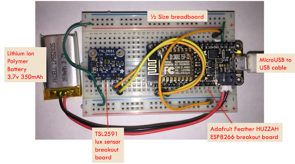

==================================================
MicroPython IoT Hackathon (featuring the ESP8266)
==================================================
This repository contains the content needed to run a MicroPython-based IoT
Hackathon using ESP8266 development boards. Atendees will work through a
pre-defined project involving a light sensor and then explore more complex
applications. Both hardware and software will be covered.

This content was originally developed for a project night hosted by the
San Francisco Python meetup group. The content was designed to make this
hackathon easily reproducable

Abstract
========
Due in large part to the availability of cheap, low-power, internet-connected
microcontrollers, the Internet of Things is taking off. Python developers can
get in on the excitement with MicroPython, an implementation of Python 3 that
runs on very small devices with no operating system. MicroPython provides
the standard Python REPL (read-eval-print-loop) interface, so you can
interactively develop and debug applications on these small devices.

In this session, you will learn some basic electronics, wire up some sensors to
a low-power wireless controller board (based on the ESP8266 microcontroller),
load the MicroPython firmware, and interactively write simple applications to
read from the sensors. We will also discuss how to connect to other systems via
the MQTT messaging protocol and exchange ideas on larger projects that can be
built at home for low cost with beginner-level knowledge.

The only prerequisite is to bring a laptop with a USB port. Here is a picture
of the completed project:

Docs
====
The rendered HTML documentation is now available on readthedocs.org:
http://micropython-iot-hackathon.readthedocs.io/en/latest/

Files in this Repository
========================
The instruction book is built using the Sphinx documentation tool [#]_.
Here's an overview of the key files and directories:

* ``docs/Makefile`` - used by Spinx to build HTML and other representations
  of the instruction book.
* ``docs/_build`` - Sphinx creates and puts its output in this subdirectory. A
  ``make clean`` in ``docs/`` will delete this directory and its contents.
* ``docs/conf.py`` - configuration file for Sphinx
* ``make_zip.sh`` - to build a zipfile with class content software and docs
* ``example_code/`` - subdirectory with Python example code
* ``lecture.pptx`` - overview presentation to give at the start of the class.
* ``lecture.pdf`` - pdf version of the overview presentation

Copyright and License
=====================
Copyright 2016, 2017 by Jeffrey Fischer and contributers.

The documentation and text in this repository is made available under a
Creative Commons
`Attribution-ShareAlike 4.0 (CC BY-SA 4.0) license <https://creativecommons.org/licenses/by-sa/4.0/>`__.
This allows you to remix, transform, and distribute the content, provided you
cite the original authors and provide your content under the same license as
the orginal. See the file LICENSE-DOCS.txt for details.

Example code and any other software in this repository is made available under
the MIT License. This allows you to reuse the examples, with very few
restrictions. See the file LICENSE-CODE.txt for details.

Acknowledgements
----------------
The following people have contributed to this repository (listed in
chronological order):

* Jeff Fischer
* Simeon Franklin
* Eric Theise
* Daniel Mizyrycki

We thank all the contributers for their help! Thank you also to
those who have participated in or facilitated past IoT Hackathons.

Release History
===============

+------------+---------+--------------------------------------------------+
| Date       | Version | Description                                      |
+============+=========+==================================================+
| 2017-08-08 |  1.3.0  | 2017 PyBay IoT Workshop                          |
+------------+---------+--------------------------------------------------+
| 2017-01-18 |  1.1.0  | Cleanup and additional details.                  |
+------------+---------+--------------------------------------------------+
| 2017-01-16 |  1.0.0  | Complete version, including MQTT.                |
+------------+---------+--------------------------------------------------+
| 2017-01-08 |  0.9.0  | Initial public version. Still need to write MQTT |
|            |         | section.                                         |
+------------+---------+--------------------------------------------------+

.. [#] http://www.sphinx-doc.org/en/1.5.1/
