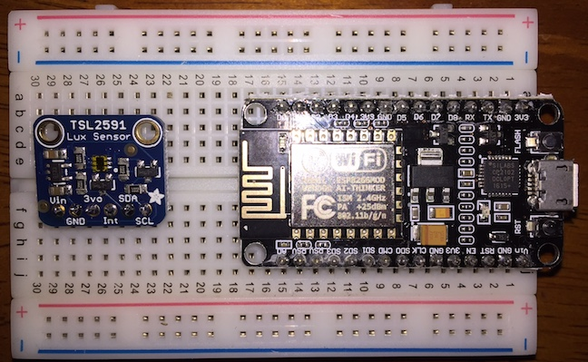
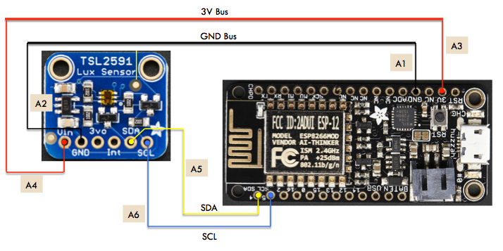
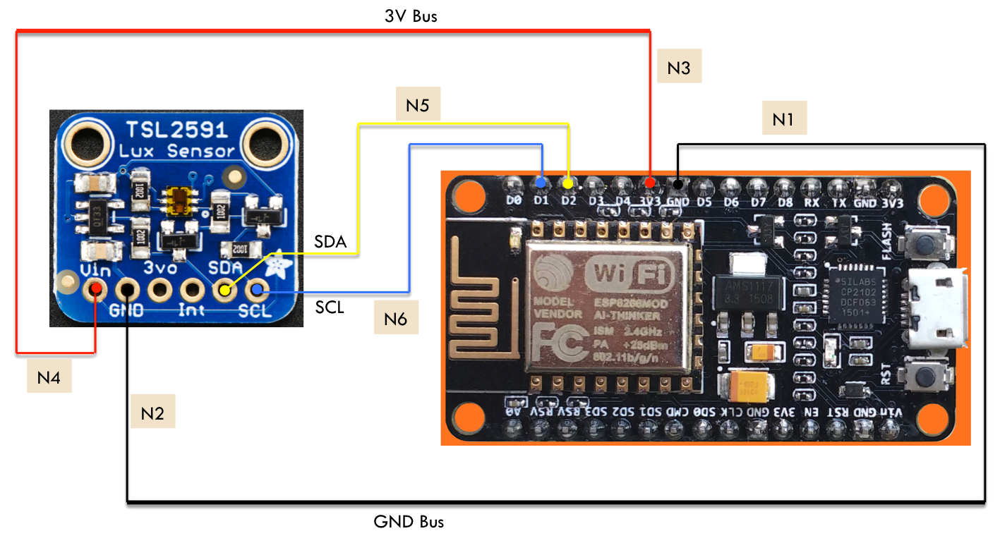
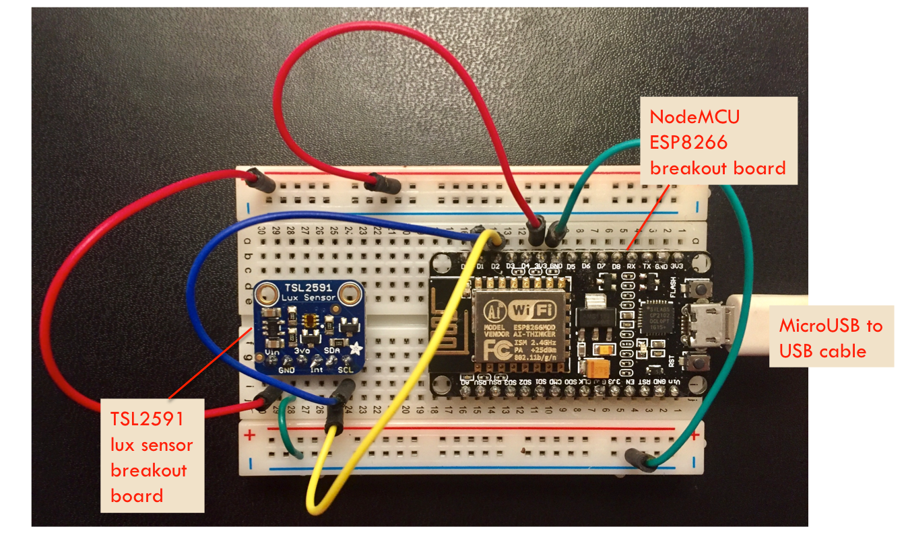

.. _hardware-assembly:

3. Hardware Assembly
====================
To assemble our system, we will connect our light sensor to the ESP8266 board.
This involves connecting ground and power, and then the two signals needed for
the I2C bus. The exact details depend on which ESP8266 board you are using
(different boards have different pinouts).

Cautions
--------
First, a few important cautions to consider when working with electronic
hardware.

Avoid Static Electricity
~~~~~~~~~~~~~~~~~~~~~~~~
Static electricity (e.g. that shock you sometimes get when touching a doorknob)
can damage electronic components. When working with the breakout boards, you
should take precautions to avoid static electricity. Some simple precautions:

* If possible, avoid carpeted floors, rubber-soled shoes, and wool clothing.
* Most computer boards and chips come in anti-static packages. Keep them in the
  packaging until you need them.
* Touch some grounded metal (e.g. your computer's chassis, if it is metal)
  before touching any electronic components.
* Ideally, use a grounded anti-static wrist strap and mat when working with
  your components.

Plenty of resources about anti-static procedures are available online
(e.g. [#]_, [#]_).

Avoid Short-circuits
~~~~~~~~~~~~~~~~~~~~
In digital electronics, electrical current flows from a positive voltage
supply (usually indicated by a red terminal), through circuitry, and to the
electrical ground (usually indicated by a black terminal). The positive power
voltage is typically 5 volts or 3.3 volts. You should **never** allow the power
lines to be connected to the ground line, without the proper electrical
components in between. Ohm's law [#]_ states that current flowing is equal to the
voltage divided by the electrical resistance. If this resistance is zero (e.g. a
direct connection), then an infinite current can flow. This is known as a
*short circuit*. Causing one will not only destroy your electrical components,
but may also damage the USB port on your computer.

OK, with that we are ready to start hooking up the hardware.

Breadboards
-----------
For easy, solderless connections that can be changed, we will use a breadboard.
The picture below shows an example breadboard and the electrical connections
that exist between the holes:

.. image:: _static/breadboard.png

If you were to peel the backing off the breadboard, you would see metal
connections matching the lines shown in the right side of the picture.
These connect individual holes in a way that can be used to facilitate
connections between pins on the boards by inserting jumper wires. There
are four horizontal connections running the length of the breadboard that
are intended for power connections. Between the top and bottom power
connections, there are two rows vertical connections, with 30 columns
(at least on our half-size board).

Seating and Soldering the Breakout Boards
-----------------------------------------
The ESP8266 and TSL2591 Breakout boards are inserted with their two rows of
pins parallel to the power connections and perpendicular to the smaller columns.
This allows the holes directly above and below the pins to be used for
connections.

If you hold the board with the blue Ground row along the bottom,
I recommend seating the ESP8266 board on the right side. The miniUSB
connector should be along the right edge of the board, for easy connectivity.
The TSL2591 board is then seated to the left of the ESP8266 board. The picture
below shows the two boards once they have been seated:

Soldering
~~~~~~~~~
If one or both of your boards do not have their headers pre-soldered, I suggest
seating the headers into the breadboard, placing the breakout board on top of the
headers, and then soldering. Detailed instructions on soldering the headers
may be found on the Adafruit website [#]_, [#]_.

Board connections
------------------
The Adafruit Feather HUZZAH and NodeMCU boards have different pinouts. Please
follow the instructions below for your board. Note that you should do all this
wiring with your board unpowered (no battery and no connection to your laptop
via USB).

The wiring tables below make power connections through the horizontal power
buses on the breadboards. This makes it easy to add more circuitry to the board
later. If you do not plan to do so, you can wire the power pins of the ESP8266
and sensor boards directly to each other, saving a few connections. Of course,
be sure to wire 3V to 3V and GND to GND.

Adafruit Feather HUZZAH ESP8266
~~~~~~~~~~~~~~~~~~~~~~~~~~~~~~~
Here are the connections to make if you have the Adafruit ESP8266 board:

+------------+-------------+---------------------------+--------------------------+
| Connection | Signal Name | Location of Source        | Location of Destination  |
| Number     |             |                           |                          |
+============+=============+===========================+==========================+
|   A1       | GND         | | ESP8266 board pin #4    | | Bottom row of          |
|            |             | | from right on top row   | | breadboard             |
+------------+-------------+---------------------------+--------------------------+
|   A2       | GND         | | Bottom row of           | | TSL2591 board          |
|            |             | | breadboard              | | pin #2 from left       |
+------------+-------------+---------------------------+--------------------------+
|   A3       | 3V          | | ESP8266 board pin #2    | | Top row                |
|            |             | | from right on top row   | | of breadboard          |
+------------+-------------+---------------------------+--------------------------+
|   A4       | Vin         | | Top row of              | | TSL2591 board          |
|            |             | | breadboard              | | pin #1 from left       |
+------------+-------------+---------------------------+--------------------------+
|   A5       | SDA         | | ESP8266 board pin #1    | | TSL2591 board          |
|            | (GPIO #4)   | | from left on bottom row | | pin #5 from left       |
+------------+-------------+---------------------------+--------------------------+
|   A6       | SCL         | | ESP8266 board pin #2    | | TSL2591 board          |
|            | (GPIO #5)   | | from left on bottom row | | pin #6 from left       |
+------------+-------------+---------------------------+--------------------------+

Here is a logical wiring diagram:

And, finally, here is a photograph of the completed system using the Adafruit
Feather Huzzah board:

.. image:: _static/lighting-app-esp8266.png

Now, please skip down below to the :ref:`testing-connections` section.

NodeMCU
~~~~~~~
Here are the connections to make if you have the NodeMCU ESP8266 board:

+------------+-------------+---------------------------+--------------------------+
| Connection | Signal Name | Location of Source        | Location of Destination  |
| Number     |             |                           |                          |
+============+=============+===========================+==========================+
|   N1       | GND         | | ESP8266 board pin #7    | | Bottom row of          |
|            |             | | from left on top row    | | breadboard             |
+------------+-------------+---------------------------+--------------------------+
|   N2       | GND         | | Bottom row of           | | TSL2591 board          |
|            |             | | breadboard              | | pin #2 from left       |
+------------+-------------+---------------------------+--------------------------+
|   N3       | 3V3         | | ESP8266 board pin #6    | | Top row of             |
|            |             | | from left on top row    | | breadboard             |
+------------+-------------+---------------------------+--------------------------+
|   N4       | Vin         | | Top row of              | | TSL2591 board          |
|            |             | | breadboard              | | pin #1 from left       |
+------------+-------------+---------------------------+--------------------------+
|   N5       | SDA         | | ESP8266 board pin #3    | | TSL2591 board          |
|            | (D2)        | | from left on top row    | | pin #5 from left       |
+------------+-------------+---------------------------+--------------------------+
|   N6       | SCL         | | ESP8266 board pin #2    | | TSL2591 board          |
|            | (D1)        | | from left on top row    | | pin #6 from left       |
+------------+-------------+---------------------------+--------------------------+

Here is a logical wiring diagram:

And, finally, here is a photograph of the completed system using the NodeMCU
board:

	   
.. _testing-connections:

Testing Connections
--------------------
Now that the system has been wired up, we can test the connections. Take your
multitester and set it to measure resistance. For each connection, place one
lead on the pin of the ESP2866 board and the other on the associated pin of
the TSL2591 board. The resistance should measure zero. You can also check for
shorts by looking at the resistance between GND and 3V. It should be a high
value.

Now, you can use the microUSB to USB cable and connect your system to your
laptop. You should see an LED light up (at least briefly) on the board. You
can test the power connection by setting your multitester to voltage mode,
placing the black lead on a GND pin, and the red lead on a 3V pin. You should
see a voltage around 3 volts.

Now, we are ready to install the :ref:`firmware and software <firmware-and-testing>`!

.. [#] http://www.howtogeek.com/169994/how-to-protect-your-pcs-hardware-from-static-electricity-when-working-on-it/

.. [#] http://www.wikihow.com/Avoid-(Static)-Electric-Shock

.. [#] https://en.wikipedia.org/wiki/Ohm's_law

.. [#] https://learn.adafruit.com/adafruit-feather-huzzah-esp8266/assembly

.. [#] https://learn.adafruit.com/adafruit-tsl2591/wiring-and-test?view=all#assembly

       
