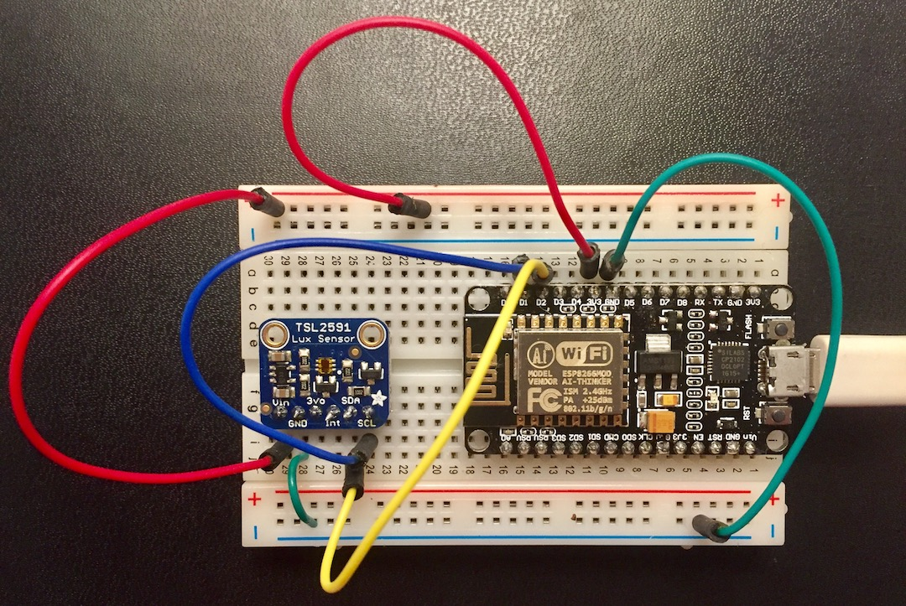
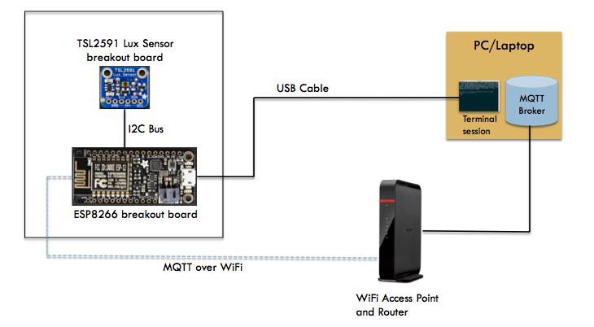

.. _intro:

1. Introduction
===============
Background
-----------
MicroPython [#]_ is an implementation of Python 3 that can on on small devices
without a traditional operating system. It requires just 256k of code space and
16k of RAM. One of the microcontrollers supported is the ESP8266 [#]_, a low
cost microcontroller with a 32-bit CPU, a built-in WiFi radio, and a number of
input/output ports useful for interfacing with the physical world. Since the
ESP8266 can run off a small lithium ion battery, it makes a great remote sensing
and control platform. Complete development boards using the ESP8266 run anywhere
from $3 to $16, cheap enough that you can deploy multiple systems.

Hardware Overview
-----------------
We will build a wireless system that combines the ESP8266 with a light
sensor (the TSL2591 ambient light sensor from AMS). Each of these will be used
via a *breakout board* -- small printed circuit boards that combine multiple
surface mount chips and provided easy connection points. The sensor and
processor connect via a digital serial protocol called I2C [#]_. This will
involve connecting a total of four connections between the boards. We will
facilitate these interconnections using a *prototyping breadboard*. The
breakout boards can be plugged into the breadboard and then the wires
stuck into the breadboard to connect the pins on the chips.

The breakout boards for the ESP2866 have a Micro-USB
connector attached to a serial port on the processor.  We will connect this to a
laptop/PC, allowing for firmware updates, file transfer, and interactive
communication.

Once the basic system is up and running, additional sensors can be added.

	   
Software Overview
-----------------
We will first update the firmware to use the latest version of MicroPython.
Then, we can copy over a library module to read the light sensor. We can
call it interactively via the Python REPL to sample the sensor. Next, we can
copy over the AntEvents framework and write a short program to periodically
sample the sensor.

To use the system remotely, we will send messages over the WiFi radio.
This involves setting up the credentials and sending messages via
the MQTT protocol (MicroPython provides a library for this). We can set
up an MQTT *broker* on the laptop/PC to receive these messages.

Finally, we will configure the ESP8266 to start our software upon reboot.
Here is a block diagram of the completed system:

GitHub Repository
-----------------
Example code and the source for this documentation are available
in a GitHub repository at: https://github.com/jfischer/micropython-iot-hackathon.

Outline of this Document
------------------------
We cover the construction and programming of the system starting
with the parts you need and moving toward end-to-end applications. The following
topics are covered:

* :ref:`parts-and-tools` - the parts you will need to find/purchase and the
  tools required to build and debug the system.
* :ref:`hardware-assembly` - connect a light sensor up to the ESP8266.
* :ref:`firmware-and-testing` - install firmware and interact with the board over
  a USB connection.
* :ref:`antevents-application` - use the AntEvents framework to build a
  simple light sensor sampling application.
* :ref:`mqtt` - use the MQTT protocol to send our sensor events over the
  wireless network.
* :ref:`projects` - we sketch out some follow-on projects involving additional
  sensors and larger applications. This is the jumping point for you to be
  creative and try out your own ideas.
* :ref:`teachers-notes` - some notes for instructors who are using the material
  as a template for a class.

OK, now let's get started with the :ref:`parts and tools <parts-and-tools>` that you need.

.. [#] http://www.micropython.org

.. [#] https://en.wikipedia.org/wiki/ESP8266

.. [#] http://cache.nxp.com/documents/user_manual/UM10204.pdf       
