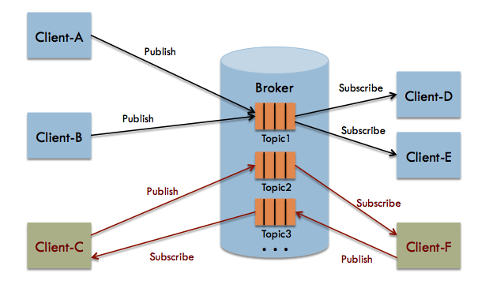
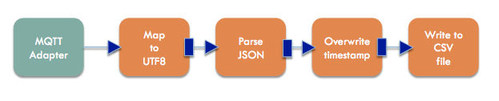

.. _mqtt:

6. Messaging with MQTT
======================
MQTT (MQ Telemetry Transport) is a lightweight publish/subscribe messaging
protocol frequently used in IoT applications. It is a very thin layer over
TCP/IP, and has many implementations. MQTT is even an OASIS
standard [#]_. The Micropython software for ESP8266
includes a client implementation in the ``umqtt`` module [#]_.

MQTT Basics
-----------
An MQTT-based application will include two or more *clients*, which are
applications exchanging messages, and a *broker*, which is a server that
accepts incoming messages and routes them to the appropriate destination
client. As with most *publish-subscribe* systems, message sends involve
*publishing* on a specified *topic*. The broker then forwards the message
to all *subscribers* of that topic. These primitives can be used to build
different interaction patterns. The picture below shows an example:

Here, we see a broker with three topics: *topic1*, *topic2*, and *topic3*,
which interact with clients using two different interaction patterns.
*Client-A* and *Client-B* are publishing their messages to *topic1*. When a
message is received at the broker, it is passed on to any current subscribers
to the topic. In this case, both *Client-D* and *Client-E* will receive each
message. We will call this a *push* pattern, as it is one directional, and the
interaction is initiated by the output_thing. In an IoT context, the
output_thing is usually a sensor node and the subscriber(s) are servers
that process and store the sensor data.

*Client-C* and *Client-F* are interacting in a request-response or
*pull* pattern. *Client-C* sends request messages to *topic2*. These
are received by *Client-F*, which sends responses on *topic3*. In an
IoT context, this pattern may be useful when the server wishes to
poll the sensor nodes for data or for situations where the sensor nodes
need to query a server for configuration data.

In our application, we will be using the simpler push pattern.

Quality of Service
~~~~~~~~~~~~~~~~~~
Networked systems are never 100% reliable -- systems may crash, connections
can be lost, or parts of an application taken down for maintenance. This is
even more true for IoT systems, where sensors may be in harsh physical
environments. Middleware like MQTT can improve reliability by storing messages
and implementing handshake protocols. However, this has a cost in terms of
resources and system complexity. MQTT gives you flexibility by specifying a
*Quality of Service* (QoS) with each message.

``qos`` is a parameter available on each publish call. It is one of three
levels:

* ``0`` -- at most once. This means that the system will make a best effort to
  deliver the message, but will not store it and will drop the message in the
  event of an error. This is typically the behavior you would use in a sensor
  application: if a message is lost, the next sensor sample will be coming
  soon, anyway.
* ``1`` -- at least once. This means that the system will use storage and
  handshaking to ensure that the message is delivered. However, in doing so
  it may send the same message multiple times, resulting in duplicates.
* ``2`` -- exactly one. This means that each message will be delivered, and
  the handshaking protocol will ensure that duplicates are not passed to
  clients. This is the behavior you want if you are implementing a banking
  system (but not so much in the IoT world).

For our application, we will use QoS level ``0``.

Security
~~~~~~~~
MQTT provides security, but it is not enabled by default. For our experiments,
we will rely on the encrypted WiFi connection to provide a basic level of
security. MQTT has the option for Transport Layer Security (TLS) encryption,
just as used with HTTPS. We recommend using that for any system you put into
production.

MQTT also provides username/password authentication. Note that the password
is transmitted in clear text. Thus, be sure to use TLS encryption if you
are using authentication.

Host-side Setup
---------------
Now, let us install an MQTT broker on our host system. We will use Mosquitto, an
open source broker from the Eclipse Foundation. It is implemented in C, and can
run well on fairly constrained systems (e.g. a Raspberry Pi). The documentation
and other other resources may be found at http://mosquitto.org. The downloads
are hosted at the main Eclipse Foundation Website, and may be found at
https://www.eclipse.org/mosquitto/download/. That page has instructions for
installing on most platforms.

You will want to install both the broker and the client utilities (in particular,
``mosquitto_sub``). On Debian-based Linux distributions (Debian, Ubuntu,
Raspbian, etc.) these are in two packages, so you will install them as follows::

  sudo apt-get install mosquitto mosquitto-clients

Once installed, make sure that your Mosquitto broker is running and listening
to port 1883 (the default). A simple test can be done with the ``mosquitto_pub``
and ``mosquitto_sub`` clients. Open two terminal windows. In one, type::

  mosquitto_sub -t sensor-data

It should hang and not print anything immediately. The process is subscribing to
the topic ``sensor-data`` and will print to standard output any messages that it
receives. In the second window, run the following::

  mosquitto_pub -t sensor-data -m "hi, there"

You should now see the message printed in the first (subscriber) window. This
means that the broker is working. You can now kill the subscriber with a
Control-C.

Finally, if your system has a firewall, make sure that port 1883 is open.
Otherwise, connections from the ESP8266 system will be blocked.

ESP8266 Setup
-------------
MicroPython already has an MQTT client in its standard library, so we do not need
to do much on the ESP8266-side. We will just copy over some convenience
modules provided by ThingFlow.

On your host machine, go to the ``micropython`` subdirectory of your ThingFlow
repository. Run ``mpfshell`` and copy the scripts for WiFi configuration and
MQTT as follows (substituting your tty device name for ``TTYDEVICE``)::

  open TTYDEVICE
  put wifi.py
  put mqtt_writer.py

Interactive Testing
-------------------
Now, go to the MicroPython REPL (via either the ``repl`` command of ``mpfshell``
or through ``screen``). We will first run our import statements:

.. code-block:: python

    >>> from thingflow import *
    >>> from tsl2591 import Tsl2591
    >>> from wifi import wifi_connect
    >>> from mqtt_writer import MQTTWriter
  
Next, we configure the WiFi connection and then connect to the MQTT broker. Here
is the code in the REPL (replace ``my_wifi_sid``, ``my_wifi_password``, and
``mqtt_broker_ip`` with values for your environment):

.. code-block:: python

    >>> SID='my_wifi_sid'
    >>> PASSWORD='my_wifi_password'
    >>> MQTT_HOST='mqtt_broker_ip'
    >>> wifi_connect(SID, PASSWORD)
    network config: ( ... )
    >>> m = MQTTWriter('esp8266', MQTT_HOST, 1883, 'sensor-data')
    Connecting to xxx.xxx.xxx.xxx:1883
    Connection successful

We can now create a sensor and connect two downstream components: ``Output``,
which prints events to the standard output, and ``m``, our MQTTWriter instance.
Here is the REPL session:

.. code-block:: python

    >>> sensor = SensorAsOutputThing(Tsl2591('lux-1'))
    >>> sensor.connect(Output())
    <closure>
    >>> sensor.connect(m)
    <closure>

Finally, we instantiate an ThingFlow scheduler and schedule our sensor to be
sampled once every two seconds:

.. code-block:: python
   
    >>> sched = Scheduler()
    >>> sched.schedule_periodic(sensor, 2.0)
    <closure>
    >>> sched.run_forever()
    ('lux-1', 611, 284.1312)
    ('lux-1', 613, 284.1312)
    ('lux-1', 615, 284.1312)
    ...

To verify that these messages are being sent to our broker, we can use the
utility ``mosquito_sub`` on the host machine. It takes one command line
argument, the topic name (in our case ``sensor-data``). We should see something
like the following when we run it:

.. code-block:: bash

    $ mosquitto_sub -t sensor-data
    ["lux-1", 624, 284.1312]
    ["lux-1", 626, 288.2113]
    ["lux-1", 627, 77.0304]
    ["lux-1", 629, 35.90401]
    ...

Great, now you have gotten live sensor data off your ESP8266 board!

Putting it all Together
-----------------------
Now, we will set up the ESP8266 to run our sample/send loop upon startup.
We will also run a script on the host to subscribe to our topic and write
the events to a CSV (spreadsheet) file. The source code for this section
may be found on GitHub in the repository for this tutorial. Specifically,
look in the ``example_code`` folder
(https://github.com/jfischer/micropython-iot-hackathon/tree/master/example_code). The program ``client.py`` will run on the ESP8266 and the program
``server.py`` will run on our host.

client.py
~~~~~~~~~
First, open an editor and create a file ``config.py`` that contains
configuration variables needed for your network and system. It should
look something like this:

.. code-block:: python

   SENSOR_ID='lux-1'
   WIFI_ESSID='my_wifi_sid'
   WIFI_PASSWORD='my_wifi_password'
   MQTT_HOST='mqtt_broker_ip'
   MQTT_TOPIC='sensor-data'
   SLEEP_TIME=5.0

You will definitely need to change the values for ``WIFI_ESSID``,
``WIFI_PASSWORD``, and ``MQTT_HOST``. The others can be left as-is.

Now, use ``mpfshell`` to copy ``config.py`` and ``client.py`` to your
ESP8266 (substituting for TTYDEVICE)::

  open TTYDEVICE
  put config.py
  put client.py

Next, open a MicroPython REPL session. To start our main loop,
we just need to import the ``client`` module. Here is what the
REPL session looks like:

.. code-block:: python

    >>> import client
    Disabled access point, network status is -1
    network config: (...)
    Connecting to xxx.xxx.xxx.xxx:1883
    Connection successful
    Running main loop with sample every 5.0 seconds...

The REPL should hang at this point because the ESP8266 is in its main
loop. Messages should be sent to the MQTT broker once every 5 seconds.

Now that we have verified the ``client.py`` script, we will configure
it to start upon boot. While still in your REPL session, enter
Control-C to break out of the loop. You should see a ``KeyboardInterrupt``
exception. We will now rename ``client.py`` to ``main.py`` using
``os.rename()``. Upon completion of its boot procedure,  MicroPython will
always run the script ``main.py`` if it is present. Here is the
REPL:

.. code-block:: python

>>> import os
>>> os.rename('client.py', 'main.py')
>>> os.listdir()
['boot.py', 'tsl2591.py', 'thingflow.py', 'wifi.py', 'mqtt_writer2.py', 'mqtt_writer.py', 'config.py', 'main.py']
>>>

Finally, press the reset button of your ESP8266 board. It will reboot.
You should see some garbage data followed by the same sequence of messages
that you saw when you imported ``client`` from the REPL.

Now, let us turn our attention to the host side of things.

Verifying messages at the server
~~~~~~~~~~~~~~~~~~~~~~~~~~~~~~~~
First, we will verify that we are getting the messages on the host.
From your command line run::

  mosquitto_sub -t sensor-data

You should see the sensor events printed once every five seconds.

server.py
~~~~~~~~~
We will next use the ``server.py`` script to read these events and write to a CSV
file. It is an ThingFlow script that subscribes to messages on a specified
topic, parses the messages, overwrites the timestamps with the server timestamp [#]_,
and writes the events to a CSV file. Here is a graphical view of the dataflow:

Here is what the core part of the script looks like:

.. code-block:: python

  mqtt.select(lambda m:(m.payload).decode('utf-8'))\
      .from_json(constructor=SensorEvent)\
      .select(lambda evt: SensorEvent(sensor_id=evt.sensor_id,
                                      ts=time.time(),
                                      val=evt.val))\
      .csv_writer(filename)
		

Since it is running on a PC or server, this script uses the full
CPython version of ThingFlow. You will need to have an installation of
Python 3. You will also need the ``paho-mqtt`` package (installable via pip)
and the ``thingflow-python``
package in your Python environment. Installing ThingFlow can be done in one of
three ways:

1. Install ThingFlow via pip: ``pip install thingflow-python``
2. Install from your local repository by going to the ``thingflow-python``
   directory and running ``python setup.py install``.
3. Just set your PYTHONPATH environment variable to the full absolute path
   of the repository directory ``thingflow-python``.

Once this is done, you should be able to run the following::

  $ python3
  >> import thingflow.base

If this succeeds, you have ThingFlow properly set up. We are
now ready to run the ``server.py`` script. It takes two command
line arguments: the topic to which it will subscribe and the name
of the out CSV file. We'll run it as follows::

  python3 server.py sensor-data test.csv

It should print a message about connecting successfully and then,
once every five seconds, print the latest sensor event like this::

  SensorEvent(sensor_id='lux-1', ts=1484535480.613611, val=371.6063)
  SensorEvent(sensor_id='lux-1', ts=1484535485.6078472, val=371.6063)
  SensorEvent(sensor_id='lux-1', ts=1484535490.4335377, val=371.6063)
  SensorEvent(sensor_id='lux-1', ts=1484535495.4575906, val=371.6063)
  ...

If you look at the file test.csv, you should see four data values for
each row:

1. The timestamp in Unix format (seconds since 1970)
2. The timestamp in human readable format
3. The sensor id.
4. The sensor value.

Congratulations! You have gotten the entire system working!

If you are interested, you can look at some more :ref:`projects <projects>` to
do with your board.

.. [#] http://docs.oasis-open.org/mqtt/mqtt/v3.1.1/mqtt-v3.1.1.html

.. [#] The ``umqtt`` module is not in the official Micropython documentation,
       but module is definitely present in the firmware image. The API is simple
       enough that you can understand it by a quick read of the source code:
       https://github.com/micropython/micropython-lib/tree/master/umqtt.simple and
       https://github.com/micropython/micropython-lib/tree/master/umqtt.robust.

.. [#] The ESP8266 does not have a realtime clock and the timestamps we get
       from it are only seconds since startup time. To work around this, we
       overwrite the timestamps on the server. This introduces some inaccuracy,
       but it should not be significant at our sample rates.
