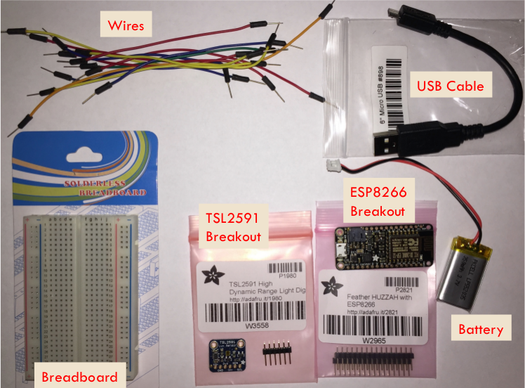
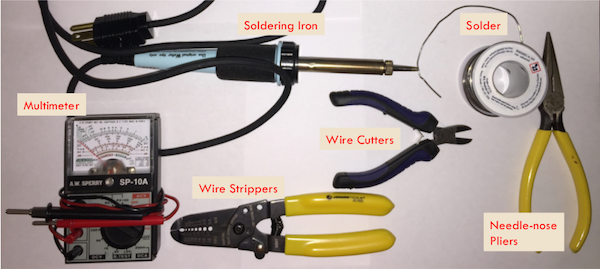

.. _parts-and-tools:

2. Required (and Recommended) Parts and Tools
=============================================
Parts
-----
The table below lists the parts required for assembling our system:

+------------------------+----------------------------------+------------------------+---------------------+
| | Part                 || Adafruit Part                   || Alternative Part(s)   | Price Range         |
+========================+==================================+========================+=====================+
|| ESP8266 Breakout      || Adafruit Feather                || Various NodeMCU       | $4.00 - $15.95      |
|| Board                 || HUZZAH with ESP8266             || boards                |                     |
|                        || WiFi (part 2821)                |                        |                     |
+------------------------+----------------------------------+------------------------+---------------------+
|| TSL2591 Breakout      || Adafruit TSL2591                || N/A                   | $6.95               |               
|| Board                 || Digital Light Sensor            |                        |                     |
|                        || (part 1980)                     |                        |                     |
+------------------------+----------------------------------+------------------------+---------------------+
|| Lithium Ion 3.7v      || Lithium Ion Polymer             || Any 3.7v with         | $6.95               |
|| 350mAh battery        || Battery 3.7v 350mAh             || JST-PH connector      |                     |
|                        || (part 2750)                     || (for Adafruit         |                     |
|                        |                                  || ESP8266 board         |                     |
|                        |                                  || only)                 |                     |
+------------------------+----------------------------------+------------------------+---------------------+
|| Half-size             || Half-size breadboard            || Various               | $2.00 - $5.00       |
|| breadboard            || (part 64)                       |                        |                     |
+------------------------+----------------------------------+------------------------+---------------------+
|| Micro-USB to          || USB cable - 6"                  || Any with data         | $2.95               |
|| USB cable             || A/MicroB (part 898)             || connection            |                     |
+------------------------+----------------------------------+------------------------+---------------------+
|| Breadboarding         || Breadboarding wire              || 22-26GA solid         | $6.00               |
|| wires                 || bundle (part 153)               || core wire             |                     |
+------------------------+----------------------------------+------------------------+---------------------+
| **Total**              |                                  |                        | **$21.90 - $43.80** |
+------------------------+----------------------------------+------------------------+---------------------+

And, here is a picture of the parts:

Details
~~~~~~~
Here are some details about each part. If you are looking to save money, see the
options discussed for each part.

ESP8266 Breakout Board
    The board from Adafruit is expensive, but high-quality and well-documented.
    It also has a built-in battery connection and can charge the battery via the
    USB. You can also use boards built for the NodeMCU project. These can be found on
    Amazon for around $9 or directly from Chinese suppliers for as cheap as $4
    (e.g. gearbest.com or alibaba.com). As the NodeMCU boards do not have a
    built-in battery connection, connecting a battery is a little more complex
    (and beyond the scope of this Hackathon).

TSL2591 Breakout Board
    This board is specific to Adafruit. It includes some extras, like a voltage
    regulator. Adafruit and SparkFun also have a breakout board for the
    TSL25**6**1. This light sensor also uses the I2C bus, but it is not as
    sensitive as the TSL2591.

Lithium Ion Battery
    You only need this if you have the Adafruit Feather HUZZAH board and are
    going to run the system disconnected from the USB (most remote sensing
    scenarios). You can also use batteries with a higher mAh rating.

Half-size breadboard
    This will fit our two breakout boards. If you have more sensors you want to
    connect, you might consider a full-size breadboard. These are available from
    many suppliers. If you are buying for a class, you might find quantity
    discounts (e.g. we found 10 boards for $1.60 each).

Micro-USB to USB cable
    This connects the ESP8266 breakout board to the Laptop/PC. You can use
    just about any such cable (you probably have a few laying around your house),
    but it must have both data and power connections.

Breadboarding wires
    These are pre-cut male jumper wires that we will use to make the connections
    on the breadboard. You can also just get a spool of insulated solid wire
    from 22 to 26 gauge and use a wire stripper and cutters to get wires of the
    right size.

Recommended Tools
-----------------
Here is a picture of the tools we recommend to build and test the system:

Details
~~~~~~~

Multimeter
    A multimeter (or multitester) is an instrument that measures voltage,
    current, and resistance. As you build your system, you can use the
    resistance measurements to check whether connections are made (should
    be either resistance of zero or infinity). You may also need/want to
    check voltages. The multimeter pictured is an old analog one. There
    are also new digital meters available for around $25.

Soldering iron and solder
    Adafruit provides the headers (a strip of plastic containing pins)
    separate from their breakout boards. We need the soldering iron and
    solder to connect the headers to the boards. This allows us to insert
    the breakout boards into the breadboard. If you are participating in a
    group hackathon, this step may have already been done for you.

Wire strippers and wire cutters
    If you are not using the pre-cut jumper wires, you will need to cut
    and strip your wires. You may want to have these tools handy anyway.
    Most wire strippers also can cut wires, but I find it helpful to have
    a separate tool.

Needle-nose pliers
    Although not strictly necessary, these can be helpful.

Now, we are ready to begin the :ref:`hardware assembly <hardware-assembly>`.

