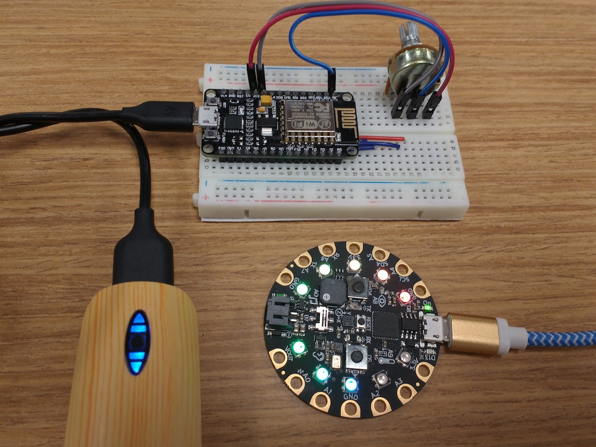

.. _projects:

7. Projects
===========
We now sketch out several projects you can build starting with your system.
These include interfacing additional sensors, software projects,
as well as incorporating the system in a larger application. Currently, this
section is just a sketch. Over time, we will fill out more details.

Sensor Data Visualization
-------------------------
Graphing Light Sensor Data in Jupyter
~~~~~~~~~~~~~~~~~~~~~~~~~~~~~~~~~~~~~
Given the CSV files we have generated, it is quite easy to use
`Jupyter <http://jupyter.org>`__ and
`matplotlib <http://matplotlib.org>`__
to graph the light sensor data over time. Here is an example plot of light
sensor data gathered using the system we have described:

.. image:: _static/lighting-app-front-room.png

Realtime Dashboard of Light Sensor Data
~~~~~~~~~~~~~~~~~~~~~~~~~~~~~~~~~~~~~~~
`Grafana <https://docs.grafana.org>`_ is an open source web application for
displaying time series data. You can use it with `Influxdb <https://docs.influxdata.com/influxdb>`_
(a time-series database) to store and visualize the light sensor data. Here is a
picture of the workflow:

.. image:: _static/grafana-workflow.png

The setup for Influxdb and Grafana is pretty straightforward. You can find a
ThingFlow script to read sensor events from a MQTT broker and write them to
Influxdb in the ``example_code`` directory of this documentation's
`Git repository <https://github.com/jfischer/micropython-iot-hackathon>`_.
The script is called ``server_mqtt_to_influx.py``. Run the script with
``--help`` to see the command line options for configuring the connections
to the broker and Influxdb.

The only non-intuitive part of the setup was the Grafana chart configuration.
Be sure to set the "Group by time interval" parameter. For a five second sensor
sample interval, use ">5s". Here is a screen shot of the full configuration
I used:

.. image:: _static/grafana-config.png

A Grafana screenshot showing a chart of the light sensor data:

.. image:: _static/grafana-chart.png

Lighting Replay Application
---------------------------
See https://github.com/mpi-sws-rse/thingflow-examples/tree/master/lighting_replay_app.
This is an application which uses captured light sensor data to train a
Hidden Markov Model. This model then is replayed when you are not home, to turn
lights on and off in a realistic manner.

More Sensors
------------
Temperature Sensor
~~~~~~~~~~~~~~~~~~
There are many temperature sensors on the market. One well-documented sensor
is the `MCP9808 breakout board <https://www.adafruit.com/products/1782>`__ from
Adafruit. Like our light sensor, it uses the IC2 bus for communication. To
use the sensor, you need four connections: ground, power, SDA, and SCL. Power
and ground can be connected to the power and ground lines of your breadboard
or directly to the associated pins on the ESP8266. For the SDA and SCL pins,
you can either connect them directly to the ESP8266 or daisy-chain them
(connect in series) through
the Lux sensor. Assuming you already have the TSL2591 sensor wired to your
ESP8266, here are the connections you will need:

+-------------+---------------------------+--------------------------+
| Signal Name | Location of Source        | Location of Destination  |
|             |                           |                          |
+=============+===========================+==========================+
| GND         | | Bottom row of           | | MCP9808 board          |
|             | | breadboard              | | pin #2 from left       |
+-------------+---------------------------+--------------------------+
| 3V          | | Top row                 | | MCP9808 board          |
|             | | of breadboard           | | ping #1 from left      |
+-------------+---------------------------+--------------------------+
| SDA         | | TSL2591 board           | | MCP9808 board          |
|             | | pin #5 from left        | | pin #4 from left       |
+-------------+---------------------------+--------------------------+
| SCL         | | TSL2591 board           | | MCP9808 board          |
|             | | pin #6 from left        | | pin #3 from left       |
+-------------+---------------------------+--------------------------+

ThingFlow for MicroPython has a sensor class for the MCP9808 located
in ``micropython/sensors/mcp9808.py``. Here is an example MicroPython
REPL session where we sample both the lux and temperature sensors using
ThingFlow:

.. code-block:: python

    >>> from thingflow import *
    >>> from tsl2591 import Tsl2591
    >>> from mcp9808 import Mcp9808
    >>> lux = Tsl2591()
    >>> temperature = Mcp9808()
    Read manufacturer ID: 0054
    Read device ID: 0400
    >>> sched = Scheduler()
    >>> sched.schedule_sensor(lux, 10, Output())
    <closure>
    >>> sched.schedule_sensor(temperature, 10, Output())
    <closure>
    >>> sched.run_forever()
    ('tsl2591', 108, 162.221)
    ('mcp9808', 108, 26.1875)
    ('tsl2591', 117, 162.221)
    ('mcp9808', 117, 26.1875)
    ('tsl2591', 126, 1.5096)
    ('mcp9808', 126, 26.1875)

Finally, Adafruit has a tutorial about using this sensor with MicroPython
`here <https://learn.adafruit.com/micropython-hardware-i2c-devices>`__.

    
Door Open/Close Detector
~~~~~~~~~~~~~~~~~~~~~~~~
Adafruit describes a project to interface the ESP8266 to a door open/closed
switch here: https://learn.adafruit.com/using-ifttt-with-adafruit-io/overview.
It is Arduino based, but should be easily adaptable to MicroPython.

Accelerometer
~~~~~~~~~~~~~
An accelerometer opens up a number of interesting project ideas. For example, a
student at the Max Planck Institute for Software Systems built a machine
learning-based gait analysis application. She used an ESP8266,
the `ADXL345 breakout board <https://www.adafruit.com/product/1231>`__ from
Adafruit,
MicroPython, and ThingFlow. A ThingFlow sensor for the ADXL345 is located
in the ThingFlow repository at ``thingflow-python/micropython/sensors/adxl345_upy.py``.
The machine learning was done in Python with
`scikit-learn <http://scikit-learn.org>`__.

Actuators
---------
Turning on an external LED
~~~~~~~~~~~~~~~~~~~~~~~~~~
Perhaps the simplest hardware interfacing is to an LED. There are many tutorials
online about how to do this. You will need three connections: from a GPIO pin
to the LED, from the LED to a resistor, and from the resistor to GND.

NeoPixel Strips
~~~~~~~~~~~~~~~
NeoPixels are addressable LED light sets available from Adafruit and others.
MicroPython provides a
`NeoPixel "driver" library <https://docs.micropython.org/en/latest/esp8266/esp8266/quickref.html#neopixel-driver>`__.
ThingFlow for MicroPython provides a convenient interface on top of this -- see
``thingflow-python/micropython/neopixel_writer.py``.

Open-ended Projects
-------------------
Adafruit Circuit Playground Express
~~~~~~~~~~~~~~~~~~~~~~~~~~~~~~~~~~~
The
`Circuit Playground Express <https://www.adafruit.com/product/3333>`__
(CPX) is a board from Adafruit
that includes a Cortex M0 processor, temperature, motion, sound, and light sensors,
NeoPixel lights, a speaker, and more. It runs CircuitPython, which is Adafruit's
port of MicroPython to their system.

There are a lot of applications possible with this kind of board. In the
directory ``example_code/cpx``, Daniel Mizyrycki has graciously provided
code from a cool demo. He uses a potentiometer connected to an ESP8266
to wirelessly control the NeoPixel lights on the Circuit Playground Express.
Here is a picture of the demo in action:

	   
Power Management
~~~~~~~~~~~~~~~~
The ESP8266 has various `power saving modes <http://bbs.espressif.com/viewtopic.php?t=133>`__.
If you have a simple sensor application that samples once a minute or less,
you should be able to turn off the WiFi radio and put the board into a
deep sleep mode. Some people claim that you can
`Run your ESP8266 for Years on a Battery <https://openhomeautomation.net/esp8266-battery/>`__,
but there probably are complications in the real world. For example:
How much power does your sensor consume? Can you turn it off programmatically?
Can you avoid DHCP initialization when the radio is turned back on?

You can use a voltage divider to reduce the battery voltage below the 1.0V
limit of the ESP8266 Analog to Digital converter. That would enable you to measure
the voltage over time. Here are some instructions at Adafruit:
https://learn.adafruit.com/using-ifttt-with-adafruit-io/wiring#battery-tracking.

On the software side, the ThingFlow scheduler optimizes samples to maximize the
sleep time. The sleep can be easily changed to one of the deep sleep modes.

Using the ESP8266 as a WiFi Modem
~~~~~~~~~~~~~~~~~~~~~~~~~~~~~~~~~
The ESP8266 was originally developed to used in conjunction with larger
microcontrollers. The intent was for the ESP8266 to provide WiFi capabilities,
while the primary microcontroller provided the main processing. In fact,
the original ESP8266 firmware included a Hayes-style ("ATDT") modem command
set over the serial port.

There are still hobbyist use cases for the ESP8266 as a WiFi modem. For example,
you might have a larger Arduino system that does not already support wireless
operation. Can you connect the ESP8266 to these kind of systems via its second
serial port? Can you emulate some modem functionality in MicroPython?

Home Assistant Integration
~~~~~~~~~~~~~~~~~~~~~~~~~~
`Home Assistant <https://home-assistant.io/>`__ is a Python3 open-source
application framework for automating your home. Since Home Assistant
already supports MQTT, it should be easy to integrate remote ESP8266
nodes into the application. Can you do it? What cool applications can
you build?

Another Micropython/ESP8266 Tutorial
------------------------------------
We recently found another tutorial about Micropython and the ESP8266.
It is more focused on lower level sensors and has some interesting
hardware projects. It is called "MicroPython on ESP8266 Workshop" and
is available here: http://micropython-on-esp8266-workshop.readthedocs.io/en/latest/index.html.

Finally, we conclude with some :ref:`advice <teachers-notes>` for hosting a
hackathon.

