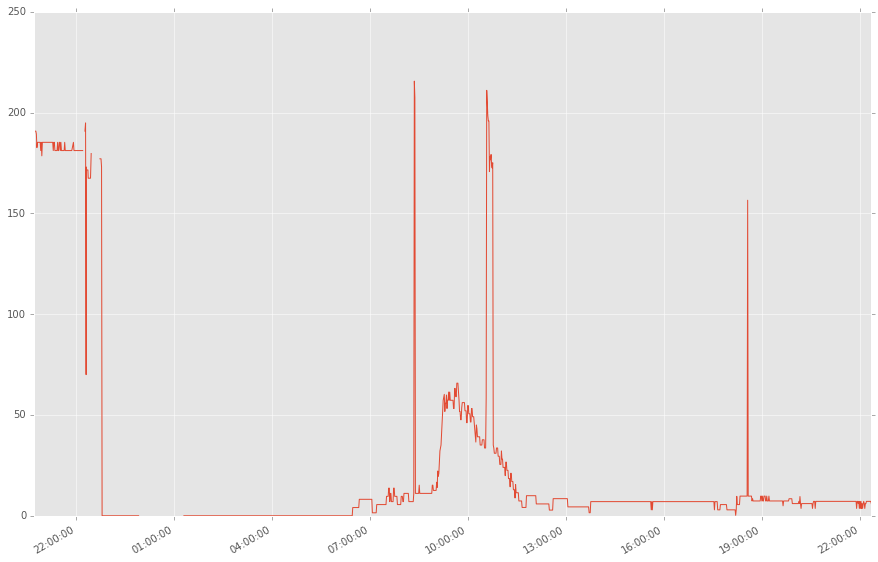
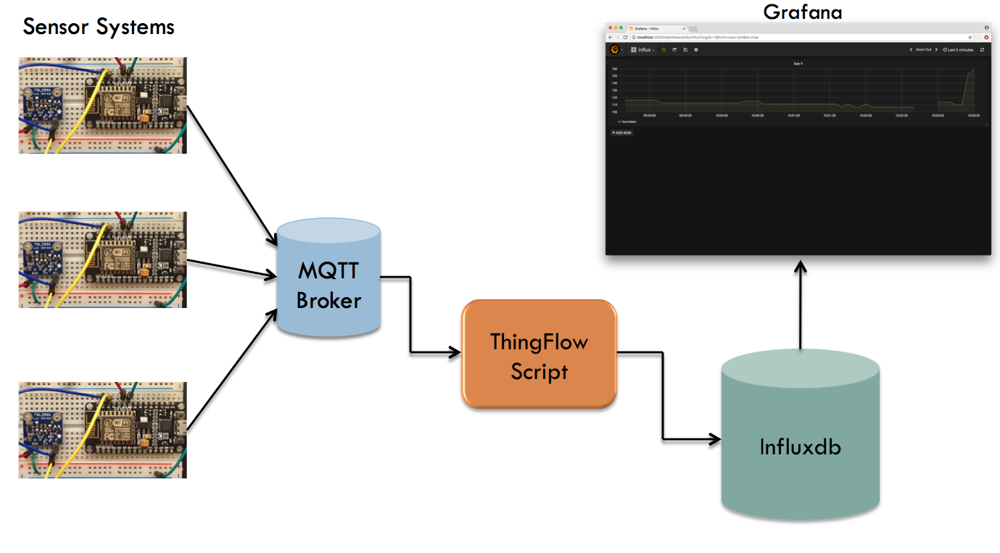
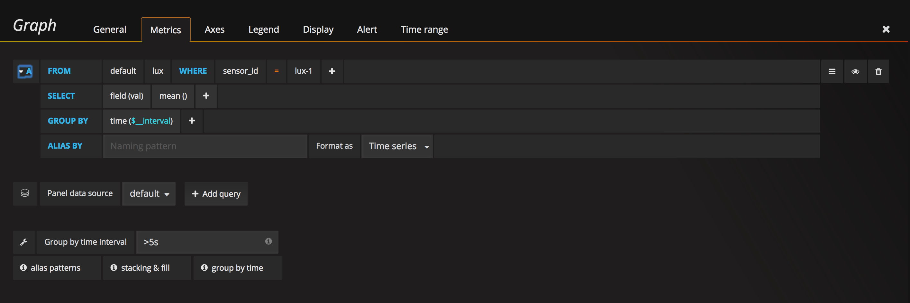

.. _projects:

7. Projects
===========
We now sketch out several projects you can build starting with your system.
These include interfacing additional sensors, software projects,
as well as incorporating the system in a larger application. Currently, this
section is just a sketch. Over time, we will fill out more details.

Sensor Data Visualization
-------------------------
Graphing Light Sensor Data in Jupyter
~~~~~~~~~~~~~~~~~~~~~~~~~~~~~~~~~~~~~
Given the CSV files we have generated, it is quite easy to use
`Jupyter <http://jupyter.org>`__ and
`matplotlib <http://matplotlib.org>`__
to graph the light sensor data over time. Here is an example plot of light
sensor data gathered using the system we have described:

Realtime Dashboard of Light Sensor Data
~~~~~~~~~~~~~~~~~~~~~~~~~~~~~~~~~~~~~~~
`Grafana <https://docs.grafana.org>`_ is an open source web application for
displaying time series data. You can use it with `Influxdb <https://docs.influxdata.com/influxdb>`_
(a time-series database) to store and visualize the light sensor data. Here is a
picture of the workflow:

The setup for Influxdb and Grafana is pretty straightforward. You can find a
ThingFlow script to read sensor events from a MQTT broker and write them to
Influxdb in the ``example_code`` directory of this documentation's
`Git repository <https://github.com/jfischer/micropython-iot-hackathon>`_.
The script is called ``server_mqtt_to_influx.py``. Run the script with
``--help`` to see the command line options for configuring the connections
to the broker and Influxdb.

The only non-intuitive part of the setup was the Grafana chart configuration.
Be sure to set the "Group by time interval" parameter. For a five second sensor
sample interval, use ">5s". Here is a screen shot of the full configuration
I used:

A Grafana screenshot showing a chart of the light sensor data:

.. image:: _static/grafana-chart.png

Lighting Replay Application
---------------------------
See https://github.com/mpi-sws-rse/thingflow-examples/tree/master/lighting_replay_app.
This is an application which uses captured light sensor data to train a
Hidden Markov Model. This model then is replayed when you are not home, to turn
lights on and off in a realistic manner.

More Sensors
------------

Turning on an LED
~~~~~~~~~~~~~~~~~
Perhaps the simplest hardware interfacing is to an LED. There are many tutorials
online about how to do this. You will need three connections: from a GPIO pin
to the LED, from the LED to a resistor, and from the resistor to GND.

Temperature Sensor
~~~~~~~~~~~~~~~~~~
There are many temperature sensors on the market. One well documented sensor
is the `MCP9808 breakout board <https://www.adafruit.com/products/1782>`__ from
Adafruit. Like our light sensor, it uses the IC2 bus for communication. Adafruit
even has a tutorial about using this sensor with MicroPython
`here <https://learn.adafruit.com/micropython-hardware-i2c-devices>`__.

Door Open/Close Detector
~~~~~~~~~~~~~~~~~~~~~~~~
Adafruit describes a project to interface the ESP8266 to a door open/closed
switch here: https://learn.adafruit.com/using-ifttt-with-adafruit-io/overview.
It is Arduino based, but should be easily adaptable to MicroPython.

Another Micropython/ESP8266 Tutorial
------------------------------------
We recently found another tutorial about Micropython and the ESP8266.
It is more focused on lower level sensors and has some interesting
hardware projects. It is called "MicroPython on ESP8266 Workshop" and
is available here: http://micropython-on-esp8266-workshop.readthedocs.io/en/latest/index.html.

Finally, we conclude with some :ref:`advice <teachers-notes>` for hosting a
hackathon.

