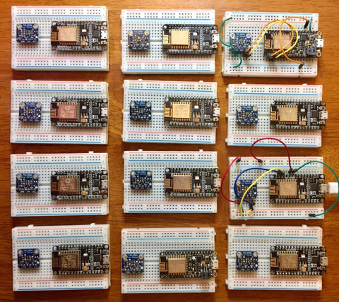

.. _teachers-notes:

8. Teachers' Notes
==================
In this section, we provide some advice to teachers of the class.

Announcement
------------
Here is a sample announcement that can be used for the Hackathon:

    Due in large part to the availability of cheap, low-power, internet-connected
    microcontrollers, the Internet of Things is taking off. Python developers can
    get in on the excitement with MicroPython, an implementation of Python 3 that
    runs on very small devices with no operating system. MicroPython provides
    the standard Python REPL (read-eval-print-loop) interface, so you can
    interactively develop and debug applications on these small devices.

    In this session, you will learn some basic electronics, wire up some sensors to
    a low-power wireless controller board (based on the ESP8266 microcontroller),
    load the MicroPython firmware, and interactively write simple applications to
    read from the sensors. We will also discuss how to connect to other systems via
    the MQTT messaging protocol and exchange ideas on larger projects that can be
    built at home for low cost with beginner-level knowledge.

    Hardware is provided, the only prerequisite is to bring a laptop with a USB
    port. Here is a picture of the completed project:
    https://data-ken.org/images/lighting-app-esp8266.png

Soldering and Hardware Preparation
----------------------------------
The breakout boards from Adafruit (e.g the Feather HUZZAH with
ESP8266 or the TSL2591 light sensor) need to have their headers
soldered to the boards. Unless your facility is a hardware lab
set up for this kind of thing, we recommend doing the soldering
in advance. For the first running of the hackathon, we soldered
the boards and seated them on the breadboard. Here's what the
set of boards looked like (10 student boards, 1 demo board, 1 spare):

I verified that each board was functional by flashing the latest version of
MicroPython to it. I did not test the light sensors, but did have a spare.

Lecture
-------
The `repository <https://github.com/jfischer/micropython-iot-hackathon>`__
containing this documentation also contains a lecture
presentation (``lecture.pptx`` and ``lecture.pdf``). We recommend walking
through this presentation before the hands-on section. The goal is to provide
students with some context and an overview of the project.
